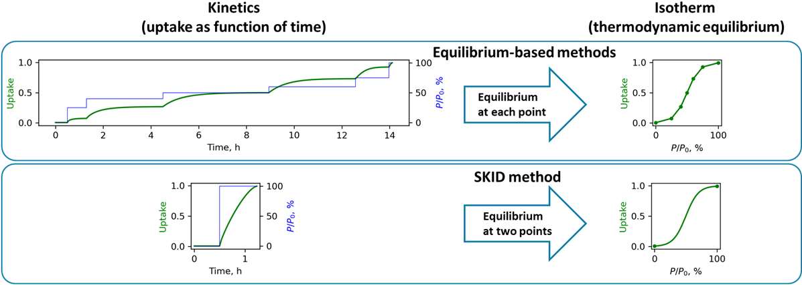
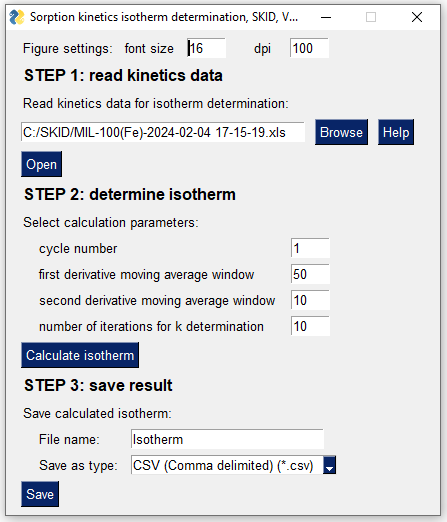
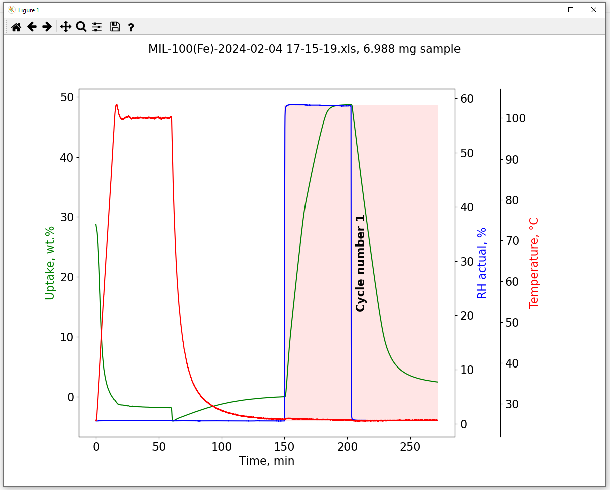
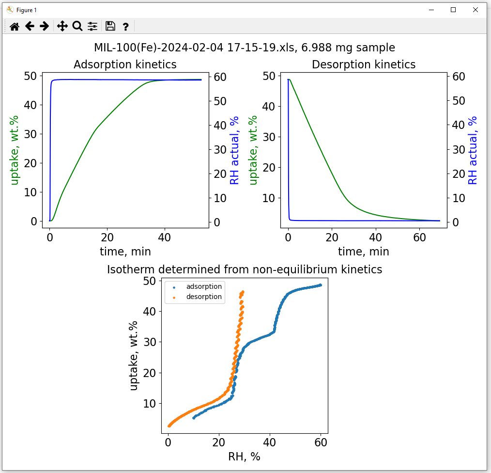

# Sorption Kinetics Isotherm Determination (SKID) Method
# 
The SKID method enables the rapid determination of experimental sorption isotherms from non-equilibrium gravimetric sorption kinetics data. This approach is *ca.* 10 times faster than conventional equilibrium-based isotherm determination methods and has potential for high-throughput testing of sorbent materials. 

The SKID method has been published in the *Chem* peer-reviewed journal ([DOI:10.1016/j.chempr.2024.01.011](https://doi.org/10.1016/j.chempr.2024.01.011)). The method has been demonstrated to work for water and C8 aromatics vapours, as well as for CO<sub>2</sub> gas. 
The code used for data analysis and visualizations in the manuscript is available in the [Manuscript](/Manuscript) folder of this GitHub repository. Additionally, corresponding data is availalbe at Zenodo repository: https://doi.org/10.5281/zenodo.7600754.  

## Graphical User Interface for SKID Data Analysis Software
To facilitate the adoption of the SKID method, we have developed an easy-to-use Graphical User Interface (GUI) for SKID data analysis software.

There are two options for running SKID GUI data analysis software: using the executable or running the Python code.

### Running SKID GUI executable

Download and run ```SKID_GUI.exe``` executable from latest [releases](https://github.com/AndreyBezrukov/SKID/releases) .

The executable is currently supported for *Windows 10*.

### Running SKID GUI Python code

Download and run [SKID_GUI.py](/SKID_GUI.py) code.

## How to Use SKID GUI

We provide a step-by-step tutorial on the rapid determination of water vapor isotherms using sorption on MIL-100(Fe) material as an example. Files required for this tutorial are available in [Examples](/Examples) folder of this GitHub repository.  

### Sorption kinetics measurement

Collect gravimetric humidity swing sorption data: kinetics in full adsorption and desorption cycle is required. 

SKID GUI supports two options for kinetics data files:

- **Option 1**: kinetics data in MS Excel format (```.xls``` or ```.xlsx```) from DVS Adventure and DVS Intrinsic instruments (Surface Measurement Systems). Only ```DVS Data``` tab is required for SKID method.
- **Option 2**: kinetics data in generic ```.csv``` file format. The file should contain following heading: ```Time[min],Mass[mg],Temperature[degreeC],RH_target[%],RH_measured[%]```

For the MIL-100(Fe) example, we collected experimental kinetics data using the DVS Adventure instrument. The [MIL-100(Fe)_kinetics.mtd](/Examples/MIL-100(Fe)_kinetics.mtd) DVS Adventure method file was used for the experiment: 0-60 % relative humidity swing with *dm/dt* = 0.05 %/min as equilibration criterion.

### Sorption kinetics data analysis  

Run the ```SKID_GUI``` software. The Graphical User Interface (GUI) will load, as shown in the figure below.
>Note that initial loading of the interface might be slow, please be patient
# 

#### Step 1: read kinetics data  
Select the [MIL-100(Fe)-2024-02-04 17-15-19.xls](Examples/MIL-100(Fe)-2024-02-04%2017-15-19.xls) or [MIL-100(Fe)-2024-02-04 17-15-19.csv](Examples/MIL-100(Fe)-2024-02-04%2017-15-19.csv) file by pressing the ```Browse``` button and then press the ```Open``` button. The software will read the file and plot the kinetics data in a new window, as illustrated below. The software will automatically identify the potential humidity swing adsorption/desorption cycle suitable for SKID calculations (**cycle number 1**).
# 

#### Step 2: determine isotherm 
Select the corresponding cycle number plotted in the previous step (**cycle number 1**). Determine the sorption isotherm by pressing the ```Calculate isotherm``` button. The calculation results will open in a new window, as shown below.
# 

#### Step 3: save result 
Save the isotherm calculation results in a file by selecting ```file name``` and ```file type``` (```CSV``` or ```AIF``` [[Adsorption Isotherm File](https://doi.org/10.1021/acs.langmuir.1c00122)]) and then pressing the ```Save``` button. 

## Citing this work

If you find the SKID method useful, please consider citing the related publication: 

>Bezrukov, A. A.;  O’Hearn, D. J.;  Gascón-Pérez, V.;  Matos, C. R. M. O.;  Koupepidou, K.;  Darwish, S.;  Sanda, S.;  Kumar, N.;  Li, X.;  Shivanna, M.; Zaworotko, M. J.;
>Rapid Determination of Experimental Sorption Isotherms from Non-Equilibrium Sorption Kinetic Data.
>*Chem*, 2024
[DOI:10.1016/j.chempr.2024.01.011](https://doi.org/10.1016/j.chempr.2024.01.011)
