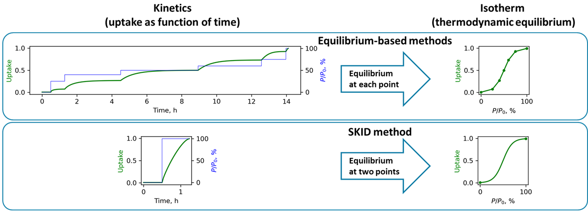

# Sorption kinetics isotherm determination (SKID) method
# 
Experimental sorption isotherms can be rapidly determined from non-equilibrium gravimetric sorption kinetics data using SKID method. This protocol is *ca.* 10x faster than the conventional equilibrium-based isotherm determination methods and has potential in high-throughput testing of sorbent materials. 

The SKID method was published in *Chem* peer-reviewed journal ([DOI:10.1016/j.chempr.2024.01.011](https://doi.org/10.1016/j.chempr.2024.01.011)) and has been demonstrated to work for water and C8 aromatics vapors, as well as for CO<sub>2</sub> gas. Code used for data analysis and visualization in the manuscript can be found in the [Manuscript](/Manuscript) folder of this GitHub repository. Corresponding data is availabe at Zenodo repository: https://doi.org/10.5281/zenodo.7600754.  

## Graphical User Interface for SKID data analysis software
In order to enable easier adorption of SKID method, an easy-to-use Graphical User Interface (GUI) for SKID data analysis was created.

There are two options for running SKID GUI data analysis software: running executable or running Python code 

### Running SKID GUI executable

Download and run [SKID_GUI.exe](/SKID_GUI.exe) executable.

The executable is currently supported for *Windows 10*.

### Running SKID GUI Python code

Download and run [SKID_GUI.py](/SKID_GUI.py) code.

## How to use SKID GUI

We demonstrate rapid water vapor isotherm determination protocol using sorption on MIL-100(Fe) material as an example. Files required for this tutorial are available in [Examples](/Examples) forlder of this GitHub repository.  

### Sorption kinetics measurement

Collect gravimetric humidity swing sorption data: kinetics in full adsorption and desorption cycle is required. SKID GUI recognizes kinetics data in ```.xls``` or ```.xlsx``` format from DVS Adventure and DVS Intrinsic instruments, as well as generic sorption kinetics data in ```.csv``` format.

Experimental kinetics data for MIL-100(Fe) example was collected using DVS Adventure instrument. 0-60 % relative humidity swing data with *dm/dt* = 0.05 %/min as equilibration criterion was collected using [MIL-100(Fe)_kinetics.mtd](/Examples/MIL-100(Fe)_kinetics.mtd) DVS Adventure method file. 

### Sorption kinetics data analysis  

Run ```SKID_GUI``` software, the Graphical User Interface (GUI) as shown on figure below will load.
>initial loading of the interface might be slow, please be patient
# 

#### Step 1: read kinetics data  
Select [MIL-100(Fe)-2024-02-04 17-15-19.xls](Examples/MIL-100(Fe)-2024-02-04 17-15-19.xls) file by pressing ```Browse``` button and press ```Open``` button. The software will read the file and plot the kinetics data in a new window, see figure below. Software will automatically identify potential humidity swing adsorption/desorption cycle suitable for SKID calculations (**cycle number 1**).
# 

#### Step 2: determine isotherm 
Select corresponding cycle number plotted in a previous step (**cycle number 1**). Determine sorption isotherm by pressing ```Calculate isotherm``` button. Calculation results will open in a new window, see figure below.
# 

#### Step 3: save result 
Save isotherm calculation results in a file by selecting ```file name``` and ```file type``` (```CSV``` or ```AIF``` [[Adsorption Isotherm File](https://doi.org/10.1021/acs.langmuir.1c00122)]) and pressing ```Save``` button. 

## Citing this work

If you find SKID method useful, please consider citing the related publication: 

>Bezrukov, A. A.;  O’Hearn, D. J.;  Gascón-Pérez, V.;  Matos, C. R. M. O.;  Koupepidou, K.;  Darwish, S.;  Sanda, S.;  Kumar, N.;  Li, X.;  Shivanna, M.; Zaworotko, M. J.;
>Rapid Determination of Experimental Sorption Isotherms from Non-Equilibrium Sorption Kinetic Data.
>*Chem*, 2024
[DOI:10.1016/j.chempr.2024.01.011](https://doi.org/10.1016/j.chempr.2024.01.011)
